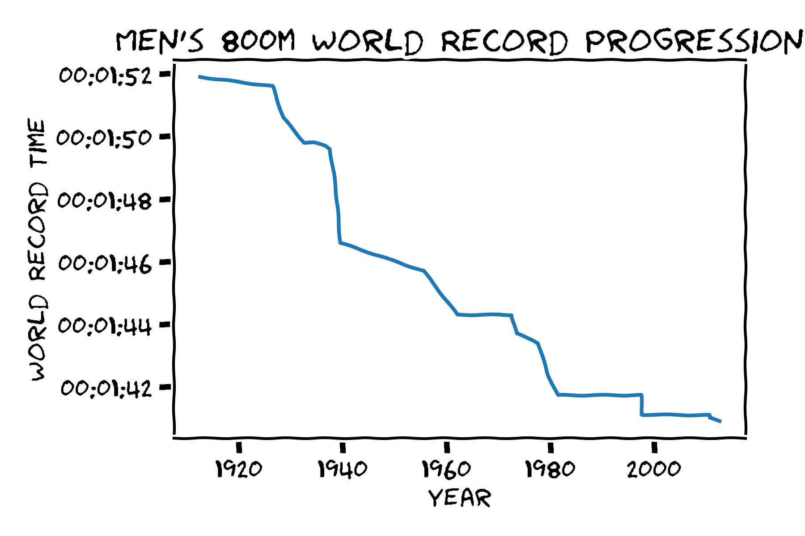
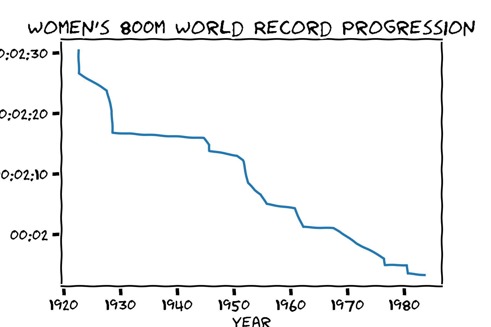

Uses matplotlib to generate xkcd sketch style plots

## Plotting in xkcd Style
Matplotlib offers an xkcd sketch style drawing option.  If you don't know the xkcd web comic, you can check it out here:

https://xkcd.com

Matplotlib also has a gallery of examples here.

https://matplotlib.org/xkcd/gallery.html

Although this functionality has been available for [quite a while](http://jakevdp.github.io/blog/2013/07/10/XKCD-plots-in-matplotlib/), I wanted to experiment with it myself!  Below, I plot how the 800 meter world record has improved over time.

## Plots

