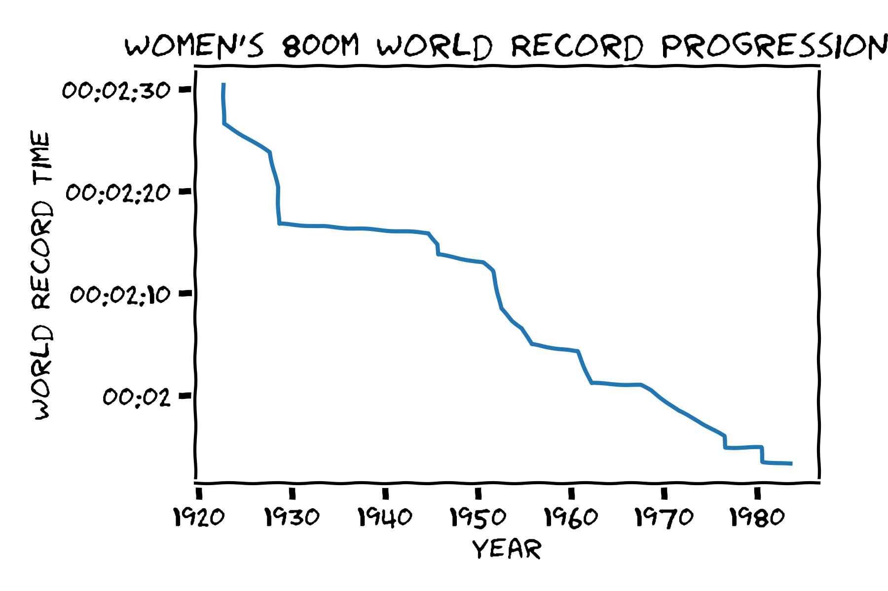

Uses matplotlib to generate xkcd sketch style plots


# Plotting in xkcd Style
Matplotlib offers an xkcd sketch style drawing option.  If you don't know the xkcd web comic, you can check it out here:

https://xkcd.com

Matplotlib also has a gallery of examples here.

https://matplotlib.org/xkcd/gallery.html

Although this functionality has been available for [quite a while](http://jakevdp.github.io/blog/2013/07/10/XKCD-plots-in-matplotlib/), I wanted to experiment with it myself!  Below, I plot how the 800 meter world record has improved over time.

# Setup

Make sure you have "Comic Sans" installed.  If you don't, you will want to install it
```
sudo apt-get update
sudo apt-get install fonts-humor-sans
```
After installing a new font, you will likely need to refresh the font cache.
```
>>> import matplotlib.font_manager                                                   
>>> matplotlib.font_manager._rebuild()
```

# Plots




# To Do

In the women's 800m plot shown above, note that the bottom y-value label is `00:02`.  Clearly, I would prefer this to be `00:02:00`.  In fact, I would prefer all the plots drop the `00:` prefix.  I'm not entirely sure the best way to do this.  It seems that you should be able to do something like [this](https://matplotlib.org/2.1.2/gallery/api/date_index_formatter.html), but it didn't work on my first attempt.
